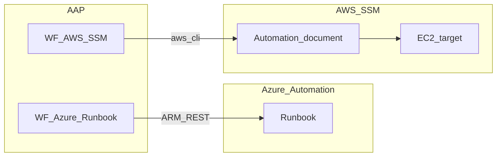

# Azure Runbook and AWS SSM Automation Demo


## Introduction

Orchestrates **pre-existing** Azure Automation Runbooks and **AWS Systems Manager Automation documents** from AAP (Use Case 3): immediate execution, scheduling, output collection, and optional email notification.

## How to run the demo

| Workflow | Purpose |
|---|---|
| WF - Azure Runbook execute and collect | Run runbook → optional email |
| WF - Azure Runbook schedule | Create job schedule |
| WF - AWS SSM document execute and collect | Run SSM document → optional email |
| WF - AWS SSM schedule via maintenance window | Register maintenance window task |

## Quick start

```bash
cd artifacts/demos/aap-demo-cloud-native-automation
ansible-galaxy collection install -r collections/requirements.yml -p collections
cp ansible.cfg.example ansible.cfg
cp group_vars/all/demo_variables.yml.example group_vars/all/demo_variables.yml
ansible-playbook playbooks/aap_config.yml --vault-id @prompt
```

See [docs/setup.md](docs/setup.md) for EE build and API prerequisites.

## Architecture



## REST/CLI design note

Certified collections do not expose runbook execution or SSM Automation run modules in this PoC scope. Playbooks use:

- `ansible.builtin.uri` for Azure Resource Manager job and schedule APIs
- `aws ssm` CLI for automation execution and maintenance windows

Document this constraint to customers reviewing support implications.

## Multicloud inventory UX (UC4)

```
Demo-Multicloud
├── Azure-Resources
│   └── azure_automation
└── AWS-Resources
    └── aws_automation
```

Same parent/child naming is used across all three PoC artifacts for a consistent AAP navigation experience.

## Job templates

| Template | Playbook |
|---|---|
| Azure - Run Runbook and collect output | `azure_runbook_run.yml` |
| Azure - Schedule Runbook | `azure_runbook_schedule.yml` |
| AWS - Run SSM document and collect output | `aws_ssm_run_document.yml` |
| AWS - Schedule SSM via maintenance window | `aws_ssm_schedule_maintenance.yml` |
| Notify - Email automation results | `notify_results.yml` (optional) |

## Collections

| Collection | Tier | Purpose |
|---|---|---|
| infra.aap_configuration | validated | CasC |
| azure.azcollection | certified | Azure auth context |
| amazon.aws | certified | AWS credential patterns |
| community.general | community | Optional SMTP email |

## References

- Microsoft Azure Automation REST API
- AWS Systems Manager Automation documentation
- Red Hat AAP 2.6 documentation
